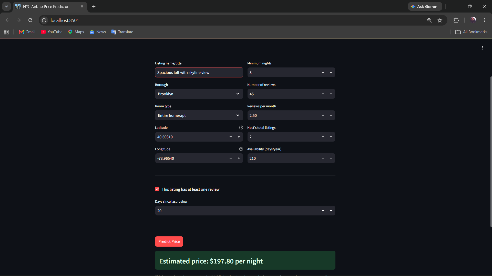

Name : Keval Anilbhai Patodiya
Student ID: 202618056

# NYC Airbnb Price Prediction

End-to-end machine learning project that predicts nightly Airbnb prices in New York City, built for DS605: Fundamentals of Machine Learning — Lab Assignment 4.

**Dataset:** [Kaggle New York City Airbnb Open Data](https://www.kaggle.com/datasets/dgomonov/new-york-city-airbnb-open-data) (`AB_NYC_2019.csv`)

## 🔗 Links

- **Live app:** not deployed yet — currently runs locally (see instructions below)
- **Notebook:** `202618056_Lab04.ipynb`

## 📊 Project Overview

The goal is to build a complete ML workflow — from raw data to a usable web app — that estimates the nightly price of an NYC Airbnb listing based on its characteristics (location, room type, availability, review activity, etc.).

## 🧹 Data Analysis & Preprocessing (Task 1)

- Dropped identifier columns not useful for prediction: `id`, `host_id`, `host_name`.
- Handled missing values:
  - Dropped 16 rows with missing `name`.
  - Engineered `days_since_last_review` from `last_review`, leaving it as missing (imputed downstream) for listings with no reviews.
  - Filled missing `reviews_per_month` with 0 (domain logic: no reviews per month reported = no recent reviews).
- **Outlier handling:** Identified extreme outliers in `price` (right-skewed, max of $10,000 vs. a median of ~$106) using IQR analysis, and removed listings above the 99th percentile (~$799). This was the single biggest improvement to model performance in the whole project.
- Capped `minimum_nights` at 30 within the pipeline, since a small number of listings had values in the hundreds/thousands.
- Feature engineering: extracted text features from listing `name` via `CountVectorizer` (top 30 words), and derived `days_since_last_review` as a recency signal.
- Final features used: `name` (text), `days_since_last_review` (recency), `latitude`, `longitude`, `minimum_nights`, `number_of_reviews`, `reviews_per_month`, `calculated_host_listings_count`, `availability_365` (numeric), `neighbourhood_group`, `room_type` (categorical).

## 🤖 Model Training & Evaluation (Task 2)

All models were trained on `log1p(price)` and evaluated after inverting predictions with `expm1()`, to reduce the influence of price's right-skewed distribution.

| Model | Test RMSE | Test MAE | Test R² |
|---|---|---|---|
| Linear Regression | 79.88 | 50.43 | 0.419 |
| Linear Regression (log-target) | 80.39 | 45.72 | 0.412 |
| ElasticNet (tuned) | — | — | 0.569 (CV) |
| Random Forest (`max_depth=16`, `n_estimators=300`) | **71.86** | **40.53** | **0.530** |
| Random Forest (`max_features='sqrt'`) | 80.08 | 44.18 | 0.416 |
| Random Forest (`max_features=0.3`) | 76.81 | 42.68 | 0.463 |
| Random Forest (RandomizedSearchCV best) | 72.91 | 40.83 | 0.516 |

**Final model:** Random Forest Regressor (`n_estimators=300, max_depth=16`), selected for the best test-set R² and RMSE.

**Overfitting check:** Train R² (0.758) is noticeably higher than test R² (0.530), showing some overfitting typical of Random Forest. Tuning `max_features`, `min_samples_leaf`, and `max_depth` via `RandomizedSearchCV` was explored to reduce this gap; the default-parameter model still gave the best held-out performance, so it was kept as final despite the gap.

The trained pipeline (preprocessing + model) is saved as `airbnb_price_model.pkl` using `joblib`, so the exact same transformations are applied to new inputs at prediction time.

## 🖥️ Application (Task 3)

A Streamlit app (`app.py`) accepts listing details — name, borough, room type, coordinates, minimum nights, review activity, and availability — and returns an estimated nightly price.

### Run locally

```bash
pip install -r requirements.txt
streamlit run app.py
```

The app will open at `http://localhost:8501`.

### Example run

Input: *"Spacious loft with skyline view"*, Brooklyn, Entire home/apt, 3 min. nights, 45 reviews, 2.5 reviews/month, 2 host listings, 210 days availability, last reviewed 20 days ago.

**Output: Estimated price: $197.80 per night** ✅



## ⚠️ Limitations

- Trained on 2019 NYC data only — doesn't reflect current market prices, seasonality, or post-2019 trends.
- No amenities, photos, or listing quality signals are used, which strongly affect real-world pricing.
- Text features from `name` are limited to the top 30 words via `CountVectorizer` and don't capture deeper semantic meaning.
- R² of ~0.53 means a meaningful share of price variance remains unexplained — predictions should be treated as rough estimates, not precise quotes.
- Not yet deployed to a public host — currently verified working via local `streamlit run`.

## 📁 Repository Structure

```
├── 202618056_Lab04.ipynb      # Full analysis, preprocessing, and model training
├── app.py                     # Streamlit application
├── airbnb_price_model.pkl     # Saved preprocessing + model pipeline
├── requirements.txt           # Python dependencies
├── app.png                    # Screenshot of the running app
└── README.md
```
